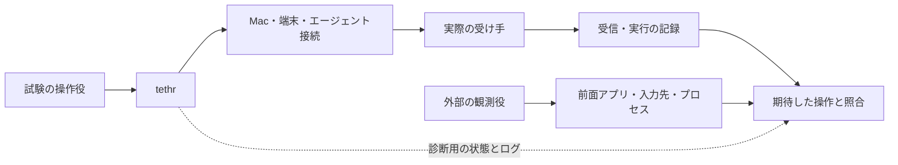

# tethr — テスト方法と合否の設計

> 履歴文書：2026-09-12の試作実装前に作成した試験計画です。その後の検証結果は[比較試作レポート](prototypes-2026-09-12.md)、現在の製品の方向性は[設計方針](../design.md)を参照してください。以下の優先順位や「未実装」は当時の記録です。

2026-09-12。技術選定の再調査を踏まえた、テスト実装前の設計案。対象は端末の短い作業、既存作業への復帰、出力の受け渡し、一般Macアプリのrun-or-raise。製品もテストハーネスもまだ実装していない。assertion-descentを標準の深さで適用し、成功条件と失敗条件、観測方法、人による判断を分けた。

## 結論

**テストの中心を「正しい関数を呼んだか」から、「意図した相手が実際に受け取り、意図した状態になったか」へ置く。**

OpenTUIの描画試験は重要だが、それだけではMac上の製品の合格にならない。専用の受け手と外部の観測プロセスを用意し、実際の入力先と作業の継続を確認する。さらに、わざと壊した実装を同じ試験に通し、試験自体が故障を検出できることを確認する。

初期試作では、全機能・全アプリを網羅する巨大な試験基盤を先に作らない。**run-or-raiseの入力先、既存シェルの継続、日本語変換の確定**を最初の三つの検証対象にする。スタックを決めるためにも、この三つの失敗を説明できることが必要になる。

## 1. 合否を決める観測の位置

製品ログは原因の説明に使う。製品が出した「成功」という文字だけで合否を決めない。期待値は試験のシナリオが持ち、受信・実行の事実は受け手やOSから取る。製品と試験側で、対象選択や成功判定の関数を共有しない。

**要求した、受け付けられた、受け手が受信した、処理を完了した、画面から使える、を区別する。** 例えば、入力を送ったことはコマンド実行完了ではなく、モデルへの依頼受信は良い回答の生成ではない。

## 2. 自動化する範囲と実機が必要な範囲

| 層 | 動かすもの | 合格で確認できること | この層では確認できないこと |
| --- | --- | --- | --- |
| 操作のロジック | 対象選択、状態遷移、制御できる非同期応答 | 古い応答の混入、二重送信、操作の取り違えを防ぐ振る舞い | OSや端末への実際の到達 |
| UIの入力・描画 | 本物のOpenTUI renderer、または各候補のUI | キー・貼り付け・リサイズに対する選択、表示、カーソル | 実IME、他アプリへのフォーカス移動 |
| プロセス間の接続 | 本物のtmux、疑似端末、テスト用の受信プロセス | 実データの到達、終了状態、作業の保持 | GhosttyやMacの画面からの操作感 |
| Macの一往復 | 実際の製品、Ghostty、受信アプリ、外部観測 | 呼び出し、アプリ復帰、実際の入力先 | 対象外の全アプリ・全Space構成への保証 |
| 普段の入力と使い勝手 | 使用中のIME・キーボード・設定、人の短い操作 | 実変換、候補窓、迷い、普段の方法との差 | 有限回の試験による全競合の不存在証明 |

OpenTUIの`createTestRenderer()`はネイティブのメモリ出力を使うが、通常の端末初期化や実ホストのraw modeまでを試すものではない。画面を捕捉する試験に加え、実エントリーポイントを疑似端末で起動する試験を別に持つ。[OpenTUI Testing](https://opentui.com/docs/core-concepts/testing/)

TauriのMac向けembedded WebDriver、SwiftのXCTestにもそれぞれ検証経路がある。比較する場合は同じ機能の成功条件を使い、フレームワーク内のテストに「E2E」と名前を付けたことをOS全体の保証に広げない。[Tauri WebDriver](https://v2.tauri.app/develop/tests/webdriver/)、[Xcodeのテスト](https://developer.apple.com/documentation/xcode/adding-tests-to-your-xcode-project)

## 3. 最重要ケースと判定方法

### A. run-or-raise後、本当にその入力欄を使える

試験専用の小さなMacアプリを二つ用意する。どちらにも識別可能な入力欄を置き、入力欄自身が受け取った文字、アプリ・ウィンドウ・欄の識別、プロセスの生存期間を記録する。同じアプリの複数インスタンスを混同しない。

1. 操作元アプリが前面で、入力欄にフォーカスがあることを準備段階で確認する。入口操作の直前を観測開始点とし、以降はシナリオに明示していないactivate・クリック・入力先の補正を禁止する。
2. 実際の入口からtethrを呼び、対象アプリを選ぶ。呼び出した直後のtethr自身のフォーカス不良も、試験側でクリックして修復してはいけない。
3. OS側の前面アプリと、取得できる場合はフォーカスされた要素を観測する。製品の完了通知だけでは次へ進めない。
4. 宛先を指定しないキーボード経路で、その試行固有の短い文字列を送る。試験役が入力先を補正せずに送り、受信側の記録を照合する。
5. 対象が受信し、操作元が受信していないこと、余分なインスタンスやウィンドウが増えていないことを確認する。

アプリが前面という条件と、特定の入力欄が文字を受け取ったという条件は分けて記録する。一般アプリのrun-or-raiseに、常にテキスト欄の存在や特定の窓の選択を要求するわけではない。入力欄は、フォーカスの引き渡しを厳しく試すための受け手である。最初は一窓・一入力欄で校正し、複数窓・複数欄は期待する選択規則が決まってから加える。

外部の観測役は、自身が前面へ出ないプロセスとしてmain run loopを回す。NSRunningApplicationの時間変化する値は、その更新を進めずに読み続けても古いままになり得る。activation通知、前面アプリ、フォーカス要素は一つの原子的なsnapshotではないので、読み取り区間を記録し、状態遷移中の差と誤配送を区別する。[NSRunningApplication](https://developer.apple.com/documentation/appkit/nsrunningapplication)、[activation通知](https://developer.apple.com/documentation/appkit/nsworkspace/didactivateapplicationnotification)、[前面アプリ](https://developer.apple.com/documentation/appkit/nsworkspace/frontmostapplication)

観測は最初の成功で打ち切らず、事前に決めた終了点まで逆戻りも記録する。AX属性が取得できない場合、取得不可という事実を残す。代わりに受信記録で限定した契約を確認できる場合もあるが、「AXによる入力先確認済み」にはしない。必要な観測の組合せは試行の前に決める。

自動入力が宛先アプリを指定したり入力先を補正したりしないことは、対象を背景に置いた対照試験で校正する。tmuxのsend-keys、Ghosttyへの直接入力、AXの値代入は接続部の試験に使えても、OSの入力フォーカスの証拠にはしない。

| 初期状態 | 成功の証拠 | 失敗の証拠 |
| --- | --- | --- |
| 対象アプリが未起動 | 対象の新しい実行インスタンスが一つ生まれ、前面化し、試験入力を受信 | 未起動のまま、別アプリが受信、重複起動 |
| 対象アプリが起動済み | 同じ実行インスタンスが前面化し、既存の欄が受信 | 新しいインスタンス・不要な窓、入力が操作元へ残る |
| 対象アプリが既に前面 | 同じインスタンス・窓のまま入力を継続 | 再起動、余分な窓、入力不能 |
| 前面化の直後に再度呼ぶ | 定義した一回の操作に対し、余分な起動・送信がない | OSキーリピート等による重複した副作用 |

activation APIへの要求はOSが許可するとは限らない。成功の根拠は結果の観測に置く。また、前面化を要求するCLI補助プロセスが、Ghostty自身に代わって操作を譲れるという前提を置かない。[Apple cooperative activation](https://developer.apple.com/documentation/appkit/passing-control-from-one-app-to-another-with-cooperative-activation)

最小化、別Space、フルスクリーン、複数窓、起動済みで窓がない状態は、基本ケースと別の行にする。どの窓を選ぶか、窓を再生成してよいかは現在の製品仕様で未決定なので、まず探索として観察結果を記録する。その後、望む期待値を固定し、新しい試行で採否を確認する。探索に使った結果をそのまま合格の証拠に再利用しない。

### B. 日本語を入力できることと、IMEが正常なことを分ける

貼り付けや完成済み文字列の入力で検証するのは、文字の保持・表示・編集である。実IMEの検証では、ローマ字入力、未確定文字、変換候補、確定キーという経路を通す。XCTestの`typeText()`は文字列の入力APIであり、要素にキーボードフォーカスが必要とされる。完成した「日本語」を渡した成功を、実変換の成功と同一視しない。[Apple typeText](https://developer.apple.com/documentation/xcuiautomation/xcuielement/typetext(_:))

| 操作 | 成功の証拠 | 失敗の証拠 |
| --- | --- | --- |
| 未確定文字を変換し、Enterで確定 | 確定文字が一度だけ入り、tethrの操作・コマンド送信件数はまだゼロ | 変換確定と同時にコマンド実行、重複文字 |
| 確定後に、操作の実行を明示する | 選んだ一件だけが送られる | 未確定文字が欠ける、二重送信、別候補を実行 |
| 変換中に候補移動・取消をする | 設定したIMEの通常操作ができ、tethrの選択や終了へ誤伝播しない | 候補選択キーでコマンド候補が動く、取消で突然閉じる |
| 日本語・結合文字・絵文字を貼り付け、編集・リサイズ | 定義した文字列が保持され、編集位置と表示が対応する | 文字欠損、二重挿入、カーソルと対象文字の不一致 |

最初は使用中のIMEで、人が短い確定・取消操作を行い、入力結果、操作送信件数、対象を含む映像を同時に記録する。候補順は学習状態に左右され得るので、特定の候補が何番目という期待値を万能の基準にしない。

物理キー相当の自動入力でこの経路を再現できれば機械化を広げる。ただし、イベント注入の到達と、実際にIMEを通った証拠を先に確認する。Ghostty内のアプリからはOSの未確定文字状態を直接取得できると仮定しない。すべてを自動化できない場合も、操作だけを人に残し、受信・誤送信の判定は自動化できる。

受信アプリでIMEが通っても、Ghosttyやtethrの証明にはならない。実際のGhostty上のtethrへ入力し、実行先は任意コマンドを動かすシェルではなく、入力と送信回数を記録する隔離した受け手にする。普段のIME設定をまず記録し、制御しやすい設定での試験と普段の設定での試験を区別する。

### C. 同じディレクトリではなく、同じ作業へ戻る

隔離したtmuxサーバーに試験用シェルを用意し、シェル内だけに非export変数と関数を定義する。開始時にプロセスと生存期間、paneの識別、サーバーの生存期間を記録する。製品が戻った後に、そのシェルだけが答えられる確認操作を行う。

**成功:** 同じシェルの状態が利用でき、試験用の受信記録が期待したpaneと実行文脈を示す。**失敗:** 同じcwdに新規シェルを作ったため変数・関数が失われる、別paneへ入力される、サーバー再起動後の古い識別で別対象を選ぶ。

具体的には、元のシェルで関数が更新するカウンターと、そこから起動した確認プロセスのOS由来の親子関係も照合する。試験の依頼文に変数の値や関数の再構築方法を含めない。cwd、PID一つ、ファイル一つの存在を単独の証拠にせず、非export状態・生存期間・状態更新を合わせる。これは「既存シェルの続きを使う」機能の契約であり、指定cwdで新規実行する機能には別の期待値を使う。

tmuxの`pane_pid`はpaneの最初のプロセスであり、現在の前景ジョブの同一性を証明しない。またcontrol modeの`%end`はtmuxコマンドの応答終端で、シェル内の処理完了ではない。実行・完了は試験用コマンド側の記録で確認する。[tmuxマニュアル](https://man.openbsd.org/tmux.1)

実行を検証する場合は、コマンド受信、実際の起動、終了コード、実行時のcwd、実行回数を、試行に対応づけて受け取る。画面にコマンド文字列がエコーされたことや、プロンプトらしい文字列が現れたことを完了判定にしない。送信件数と実行件数も分ける。

ここには設計上の限界がある。任意の既存paneは、対象確認と入力送信の間にも前景プログラムが変わり得る。直前に再確認するだけでは、この競合を完全には閉じられない。**任意paneへのキー送信に、意図したシェルでの確実な実行という保証を付けない。** 強い保証が必要な処理では、受信を確認できる実行経路や、tethrが管理する作業を使う案を比較する。この接続方式は未決定である。

### D. 画面を隠しても作業が続く

試験用の長時間プロセスに、試行固有の連続番号を書かせる。tethrを隠した後も番号が進むこと、再表示後に同じプロセスが応答することを確認する。

**成功:** 画面の非表示をまたいで作業が進み、同じ対象へ戻れる。**失敗:** UIの終了処理が子プロセスを殺す、再表示時に新しい作業へ差し替わる。プロセスが存在するだけでは、停止したままのジョブを見逃すため合格にしない。

### E. 待っている間に対象が変わっても取り違えない

検索やエージェント応答は、待ち時間をsleepで作らず、試験側で解放順を制御する。対象Aへの要求を保留し、対象Bへ切り替えてからAの応答を返す。

**成功:** Aの応答はAに結び付いたまま扱われ、Bへの送信や選択を発生させない。取り消し済みなら、取り消し後に新しい副作用要求を発行しない。**失敗:** 最新画面の対象へ古い結果が混入する、古い候補の確定で別の操作が走る。

OSへ既に渡った前面化要求や、外部に届いた処理まで取り消せたとは報告しない。応答が失われた場合も、到達不明の操作を無条件で再送しない。受信側に重複防止がなければ、Exactly Onceの保証は置けない。

利用者が途中で別アプリへ移った場合は、自動試験では明示的な割り込み操作として記録する。製品がそれを無視して再びフォーカスを取り返さないかを観測する。既にOSで待機中の要求がどう扱われるかは、別の実機観察として残す。

### F. 選んだ出力を、選んだエージェントへ渡す

最初は受信内容だけを記録するテスト用エージェント接続を使う。選択時点の文字列を固定し、試行・対象・依頼文・選択した出力を受信側で照合する。

**成功:** 選んだ内容だけが選んだ対象へ所定の回数届く。**失敗:** 後から増えた出力が混入、別の会話へ送信、依頼文欠落、二重送信。画面の選択文字列と端末の生バイト列は同じとは限らないため、改行や折り返しを含むどの表現を送るかを先に決める。

その後、実際のエージェント接続方式で同じ受信契約を確認する。テスト用受け手での成功は、実プロバイダーとの接続成功でも、回答品質の成功でもない。

### G. 候補を見る、入力へ置く、実行する、を取り違えない

コマンド候補を表示・選択する試験では、外部の実行件数がゼロであることも確認する。入力へ置くだけの機能を採用する場合は、改行を含む貼り付けでもその契約を守れるかを別途試し、表示できたことを「未実行」の証拠にはしない。明示した実行操作の試験では、選択した操作・引数・実行先が受信記録と一致することを確認する。

ここでの選択は、候補の選択状態だけを変える操作を指す。Enter等にどの意味を割り当てるかは別のUI設計であり、候補を選んで実行するまでを一操作にまとめるUIを禁止するものではない。

固定した検証用コマンドに、日本語と空白を含むパス、標準出力と標準エラー、非ゼロの終了状態を持たせる。画面上の成功表示と実際の終了状態が一致しない場合は失敗にする。出力の折り返しなど、画面向けの変換は実行結果のデータと分けて判定する。

## 4. OpenTUIの描画試験で避ける誤判定

通常の入力試験では、操作前後の文字フレーム、選択対象、カーソル、出力した操作を照合する。全画面のスナップショットだけに依存せず、候補の識別や件数といった意味のある結果を中心に置く。見た目の差を守る必要のある小領域だけ、表示の期待値も固定する。

`frameCount`はJavaScript側のループ試行回数であり、ネイティブ描画完了とは異なる。既知の表示変更を与えた区間で、`nativeFrameCount`の増分とセルの変化を記録する。`cellsUpdated`は最新フレームの値なので、静止後の最後の一回がゼロでも失敗とは限らない。[OpenTUI Rendering diagnostics](https://opentui.com/docs/test-and-debug/rendering-diagnostics/)

OpenTUIにはネイティブ描画だけを止め、JavaScriptのループを続けられる設定がある。この状態を故障注入に使い、「ループが動いているだけ」の試験が描画成功を報告しないことを確認する。[OpenTUI環境変数](https://opentui.com/docs/reference/env-vars/)

別の疑似端末試験では、通常のエントリーポイントを起動し、入力とウィンドウサイズ変更を送り、出力と終了を観測する。正常終了、初期化失敗、通常の中断で端末状態が戻ることを確認する。強制終了で必ず正常な終了処理が走るという保証は置かず、その場合の回復方法を別扱いにする。

## 5. テスト自身を壊れた実装で確かめる

最初に次の故障を、試験用の接続部や小さな変種へ一つずつ入れる。本体の期待値は変えず、正常版と同じシナリオで検出されることを確認する。

| 故障注入 | 必ず検出する試験 |
| --- | --- |
| 前面化処理を空にして成功だけ返す | OS状態と宛先未指定入力の受信確認 |
| 選択した相手と異なる相手へ送る | 対象側・操作元側の受信記録の照合 |
| 同じcwdで新しいシェルを作る | シェル固有の変数・関数と生存期間の照合 |
| UIを隠す際に作業も終了する | 非表示中の進行と、再表示後の同一プロセスへの応答 |
| 古い応答で最新の対象を上書きする | 非同期応答の順序を入れ替える試験 |
| 描画を止めてループだけ回す | 変更区間のネイティブ描画記録 |
| 受信の証拠ファイルを欠損させる | 合格にならず、証拠不足として報告 |

故障注入版が緑になる場合は、本体を直す前に試験の観測方法を直す。単にランダムな変更で落ちたことではなく、狙った故障が、狙った判定理由で検出されたことを記録する。

## 6. 実行環境、待ち方、結果の分類

Macのフォーカスは共有資源なので、画面を使う試験は同じログインセッションで直列に実行する。普段の作業と競合しない専用のテスト環境を優先する。試験用アプリの受信確認と、実際に使うアプリでの相互運用確認は分けて報告する。

動作開始前に、ソースの状態、ビルド成果物、依存バージョン、OS、Ghostty・tmux、IME、キーボード設定、画面・Space条件、必要な権限、サンドボックス条件を記録する。コミットがない・変更が未コミットの場合もあるので、HEADだけで実行物を識別せず、対象ソースと成果物のダイジェストを使う。

待つ条件は、受信通知、フレーム変更、プロセス終了などの観測可能な出来事にする。上限時間を設けた読み取りのポーリングはよいが、sleep後に成功扱いする方法や、失敗した操作の自動再実行で隠す方法は採らない。運用上のタイムアウトと、「快適」と判定する応答時間の基準は別にする。

| 結果 | 意味 |
| --- | --- |
| PASS | 必要な前提と証拠が揃い、成功条件を満たした |
| FAIL | 観測した結果が成功条件に反した、または正常な観測器で事前の期限までに必要な状態に到達しなかった。追加ログが欠けても確認済みの誤送信等は失敗のまま |
| INCONCLUSIVE | 前提不成立、観測器の障害、証拠不足などで判定できない |
| NOT_RUN | その試験を実行していない |

必須ケースにINCONCLUSIVEやNOT_RUNが残れば、受け入れ済みにはしない。権限不足や前面化できないテスト環境をskipして緑に変えない。失敗後に取り直した成功は、初回失敗を消さず別の試行として残す。試験で作ったプロセスや一時領域の片付けも結果に含める。

観測器には起動時の校正と試行中の生存確認を持たせる。正常な観測器が記録を続けているのに受信が起きなかった場合はFAILであり、単に受信記録がないという理由で証拠不足へ逃がさない。受信ログの採取自体が止まった場合はINCONCLUSIVEとする。

「別の受け手には届いていない」「遅れて取り返さない」という負の条件も、定めた観測区間に対する結果として記録する。有限回の試験で、将来のすべての配送・競合が起きないと証明したことにはしない。

## 7. LLMに返す失敗の最小セット

全ログをそのまま渡すより、次の情報を一つの失敗に結び付ける。

| 情報 | 用途 |
| --- | --- |
| ケース、期待した結果、実際の結果 | 何を直すべきかを固定する |
| 実行したソース・ビルド・試験の識別 | 別の成果物の成功を混ぜない |
| 操作順と入力、乱数seedや応答解放順 | 再現する |
| 選択した対象と、受け手が記録した対象 | 誤送信を見分ける |
| 製品の要求、OS観測、受信記録の時系列 | どの境界で食い違ったかを見る |
| 必要な範囲の前後フレーム、画面、受信内容 | 表示と実際の結果を比較する |
| 実行環境と欠けた証拠 | 製品の失敗と試験環境の失敗を区別する |

時刻は、同じ単調時計を使うか、独立プロセス間で対応付けの方法と精度を記録する。別プロセスの起点が異なる値を単純に引き算しない。試験用の合成データを使い、利用者の既存セッション全体を採取する必要はない。

再現できるロジック試験には失敗した入力系列を残す。実IMEやフォーカス競合には、環境と映像も残す。映像やイベント列を保存したことと、同じ競合を自動で再現できることは区別する。

診断用プラグインやビルド設定が異なる場合は記録を分け、診断版での成功を普段使う成果物の成功に移し替えない。動的に読み込むJavaScriptや資産がある構成では、ランタイムの実行ファイルだけでなく、それらも識別する。最終的な受け入れは、実際に使う成果物でも同じ外部観測で行う。

### LLMへのフィードバックが役立つかも、小さく測る

「詳しいログがある」だけでは、LLMが修正しやすい証拠にならない。将来の小実験では、旧応答の混入、宛先の取り違え、非表示によるジョブ終了など、対応する故障を候補間で揃える。同じモデル・設定の独立した作業者へ、対象ソース、再現手順、失敗記録を渡す。

実装担当から離した判定器で、修正後に元の失敗と関連ケースを再確認する。故障から診断材料が揃うまでの時間、正しい修正に至ったか、修正に必要な試行数、追加調査・人への問い合わせ、利用量が取得できる場合はその値も記録する。試験を削除したり期待値を緩めたりして緑にした修正は受け入れない。

モデル同士の同意や、もっともらしい原因説明は合格の根拠にしない。小実験の結果も、試した故障とモデルに限った観測として扱う。この実験は今回実施しておらず、実施時の試行数や予算は事前に決める。

## 8. 速さと「嬉しさ」の比較

技術選定の比較では、全候補に同じ初期状態、対象、作業、成功条件を使う。OpenTUIの内部描画時刻と、Swiftの起動完了時刻をそのまま比べない。

測る区間は、入口の操作から「入力できる」まで、対象の確定から「対象が受け取れる」まで、一つの用事を完了して作業へ戻るまで。初回起動、起動済みからの呼び出し、対象アプリの起動有無を分ける。時刻の単位と観測点を明示し、実際に入力を受け付けることを伴わない表示だけの速さは別の指標にする。

最初は普段の方法と試作品を同じ用事で交互に使い、完了率、手動コピー・再選択・訂正の回数、所要時間を記録する。少数の試行では全測定値と試行数を見せ、p95だけで優劣を断定しない。人には「どちらを次も使いたいか」と、その理由を尋ねる程度に留める。

**現在のリポジトリには応答時間の基準値もベンチマークの実行コマンドもない。** 数値を創作して合格にしない。探索的な実測を集めて必要な基準を別の判断として決め、その基準を固定した後の新しい試行で確認する。探索結果を、後から作った基準への合格実績として再利用しない。正しさの条件を満たさない案は、速くても合格にはしない。

## 9. 実装する順序と、引き渡し時の条件

1. run-or-raise用の受信アプリと外部観測、既存シェルの確認用fixtureを小さく作る。正常な既知の操作で記録が取れ、空の前面化や新規シェルへの差し替えを検出できるところまで確認する。
2. tethrの最小の呼び出し・対象選択・復帰をその試験へ接続する。OpenTUIの描画試験と実際のMacの結果を分ける。
3. 使用中IMEで確定・取消の短い実操作を行い、変換確定で誤送信しないことを確認する。
4. 非表示中の継続、古い応答、出力の受け渡しを、機能追加に合わせて増やす。
5. 実際に使うアプリとSpace条件を追加し、普段の方法と比較する。失敗した部分に応じてSwift側の責任範囲やUI方式を見直す。

現時点でリポジトリにpackage.json、Makefile、テスト実装はない。したがって、登録済みであるかのような実行コマンドは提示しない。実装担当は採用する実行系に最小のコマンドを定義し、fixture準備、必要な環境、証拠保存先、終了コードと結果分類、片付けの手順をREADMEに残す。

保守性の設計案としては、操作のロジックをUIやOS接続から分け、対象識別と結果分類を型・スキーマで区別することを推す。これは全候補共通の機能合格条件とは分ける。この構造を採用していない小さな試作を、それだけで機能不合格にはしない。採用後の型やlintの合格も補助であり、受信の証拠を置き換えない。

引き渡す際は、この文書のうち実装対象になるケースの期待値と必要な証拠を先に固定する。実装担当は、既存テストの削除・弱体化、実装に合わせた期待値の変更、型エラーの無根拠な抑制、エラーの握りつぶし、成功するまでの再実行を行わない。条件を変える必要が生じたら、変更理由と影響を設計に戻して記録する。

## 10. まだ人の判断として残すこと

- 呼び出し・復帰のどの速さと操作数なら、普段の方法より使いたいか。
- 複数窓、最小化、別Space、窓なしで、どの結果を望むか。
- 日本語の候補窓や表示が読みやすく、操作に迷わないか。
- 任意の既存paneへの入力にどこまで保証を求め、保証できない場合にどの接続方式を選ぶか。
- フォーカスを他アプリへ移した時点で、保留中の操作をどのように扱うか。

自己レビューとして「全テストが緑でも拒否する理由」を検討した。wrong target、変換確定での実行、新規シェルへの差し替え、試験のフォーカス補正は機械検証の条件へ追加した。一方、快適さ、窓の選び方、保証範囲の選好は人の判断として残す。これらが決まっていないことを、製品の実装完了とは扱わない。

今回の成果は、観測点・合否・故障注入・試験の段階を具体化した設計である。前回のSwiftコンパイル、アプリ情報取得、隔離tmuxの小試験は接続部の限定的な確認であり、この文書の受け入れ試験が通ったことは意味しない。
